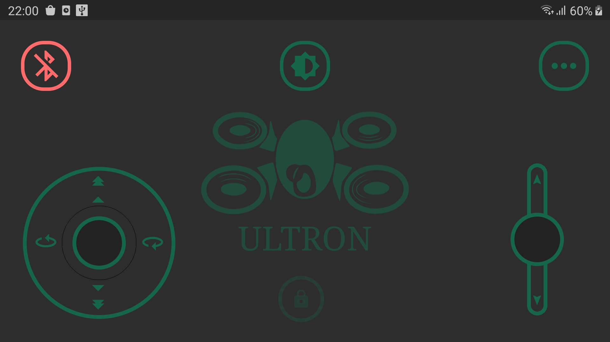

Está em cogitação o uso de um intermediador (gamepad) para converter sinais de bluetooth para rádio 2,4GHz, permitindo um aumento considerável no alcance do sinal. 
De forma resumida, o projeto consistirá em:  

<b>Joystick(Android)</b> <---> <b>Gamepad(Arduino)</b> <---> <b>Drone(Arduino)</b> 

## Em relação aos componentes, de forma resumida, está sendo usado:

* Gamepad: 
    * Arduino Pro Micro;
    * Módulo Bluetooth HC-05;
    * Módulo de rede sem fio NRF24L01.

* Drone: 
    * Arduino Pro Micro;
    * 4x Brushed Motors e seus respectivos ESC's;
    * Módulo acelerômetro/giroscópio MPU6050;
    * Módulo de rede sem fio NRF24L01.
 
