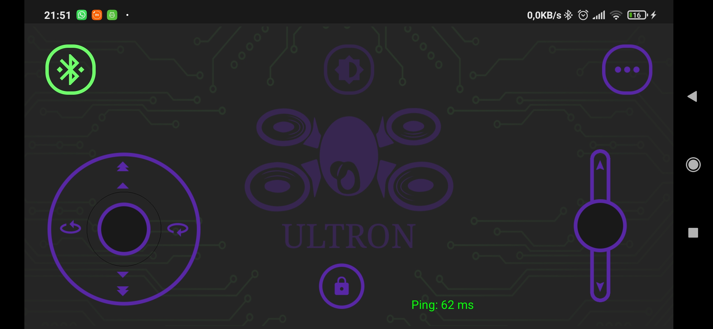

Está em cogitação o uso de um intermediador (gamepad) para converter sinais de bluetooth para rádio 2,4GHz, permitindo um aumento considerável no alcance do sinal. 
De forma resumida, o projeto consistirá em:  

<b>Joystick(Android)</b> <---> <b>Gamepad(Arduino)</b> <---> <b>Drone(Arduino)</b> 

## Em relação aos componentes, de forma resumida, está sendo usado:

* Gamepad: 
    * Arduino Pro Micro;
    * Módulo Bluetooth HC-05;
    * Módulo de rede sem fio NRF24L01.

* Drone: 
    * Arduino Pro Micro;
    * 4x Brushed Motors e seus respectivos ESC's;
    * Módulo acelerômetro/giroscópio MPU6050;
    * Módulo de rede sem fio NRF24L01.
 

Captura de tela 

Circuito do gamepad

Circuito do drone

## 21/10/2021
Implementado um algoritmo para, paralelamente à requisição de Ping, realizar também medição da bateria tanto do gamepad quanto do drone. 
O modo que será usado para medir a voltagem de ambos será via entrada analógica usando um regulador de tensão. 
Apenas o algoritmo para o recebimento via mobile foi terminado. A implementação feita no sketch é para, pelo menos até o momento, enviar um valor random  na faixa de 2.5 ~ 4.5, que representariam a metade do min/max da tensão de entrada (5v até 9v). 
Conforme ocorre a aquisição do restante dos componentes, será implementado um algoritmo voltado à mensura da voltagem e envio dos dados corretos ao celular.